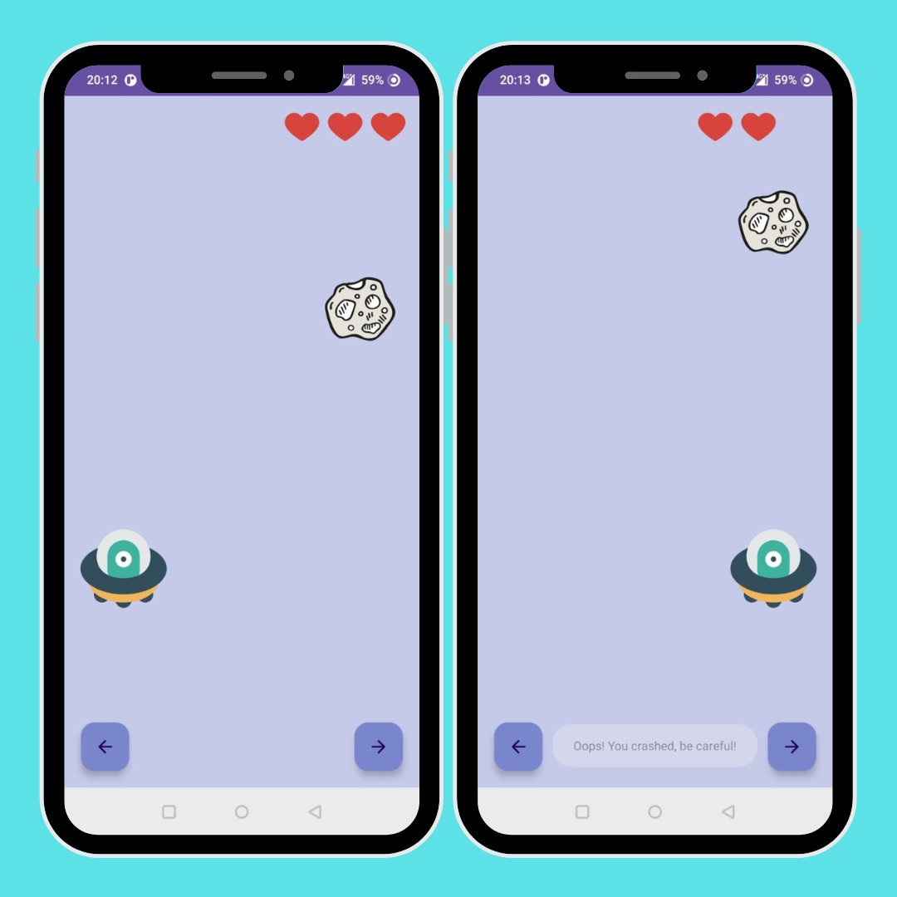
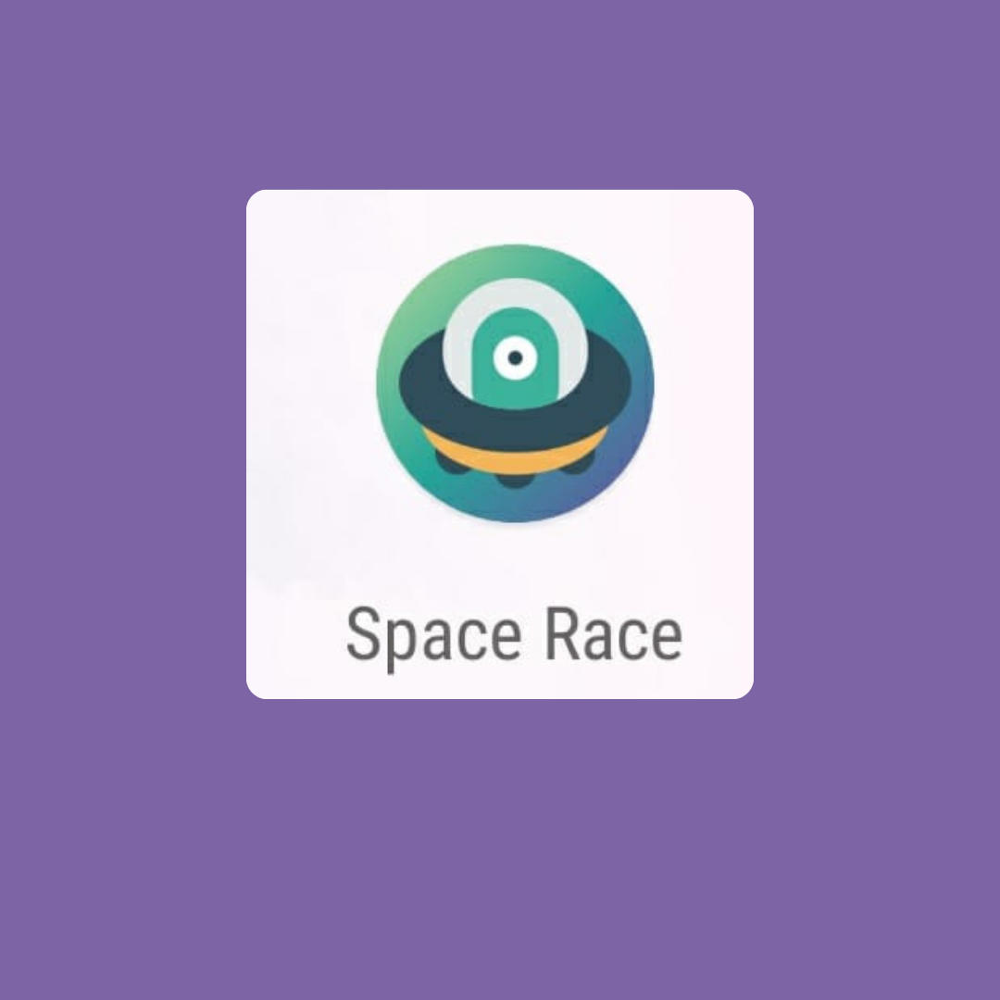
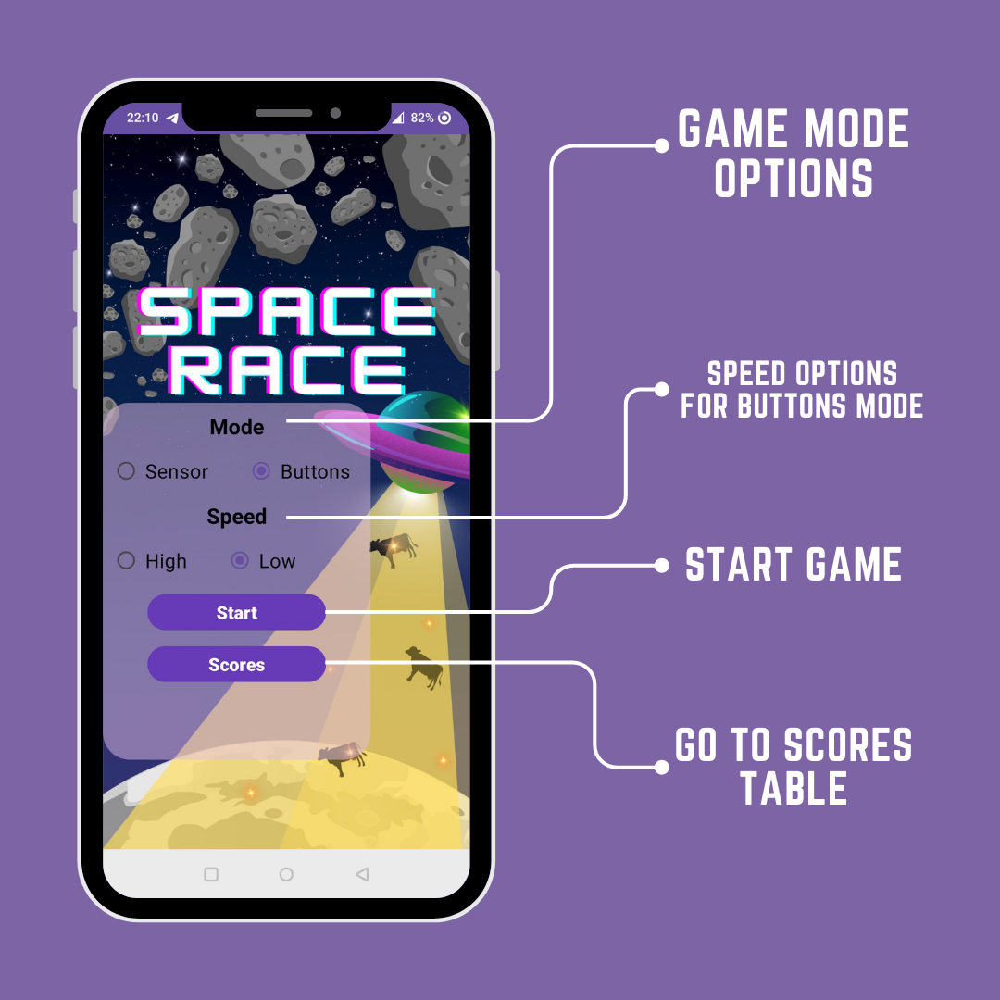
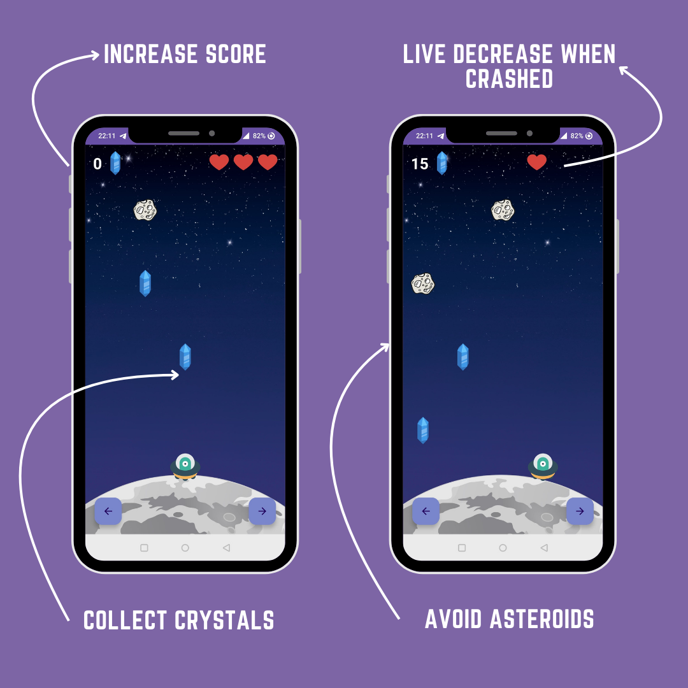
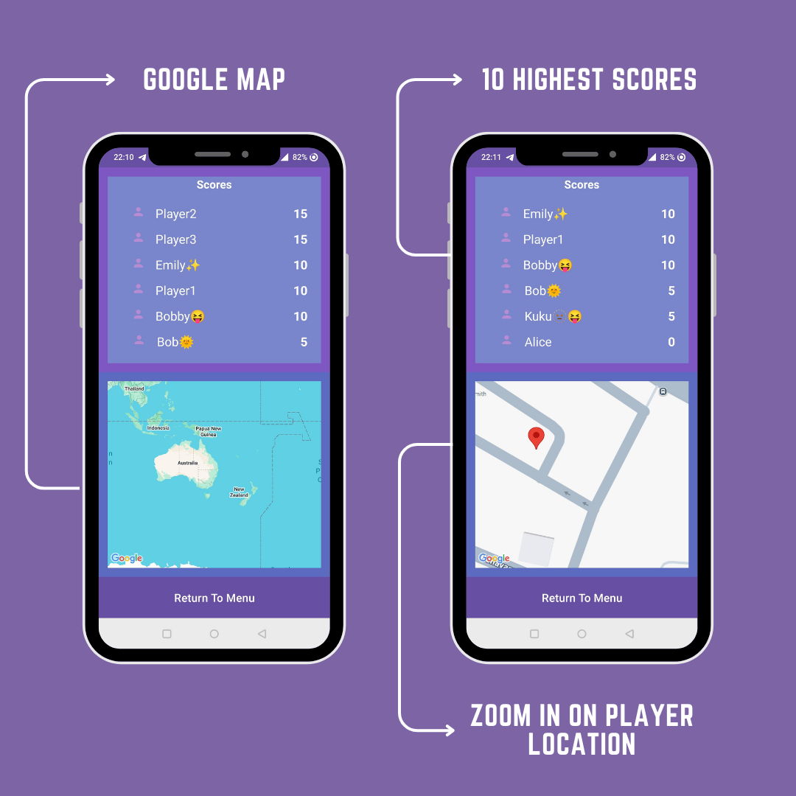

# About
This project is part of the Cellular Applications course at Afeka College (Course Code: 10357). The initial phase of the project focuses on developing an obstacle race game. 
## First Part
The first phase demonstrates the following features:
* Three-lane road
* Object (ufo) that can move left and right
* Obstacles (asteroids) on the road
* Driving at a constant speed on the road (obstacles come to you)
* Crash notification (Toast message + vibration)
* 3 lives (decrease when crashed)
* Endless game (3 lives after death) - for now.

## Second Part
The second phase demonstrates the following features:
* Icon
  
* Tilt right for move right and tilt left to move left
  Sensors of phone was used - Sensor.TYPE_ACCELEROMETER
* A wider five-line road
* Crash and collect sounds. Also background sound.
* Crystals on road. If you collect them you will increase your score.
* Menu with 3 options:
  1. 2 Button modes - slow and fast (speed of obstacles arriving)
  2. 1 Sensor mode
  3. Buttons for start and score table
* Record table screen - done in two different fragments - a screen containing a table with ten highest records since the game was installed and a map of locations where the   records were recorded in the table, clicking on a record will update the map location view accordingly.
  For saving of scores, Shared Preferences were used.
* Integration with Google Map - zoom in on player location from Score Table.

### Menu Screen

### Game Flow

### Scores

